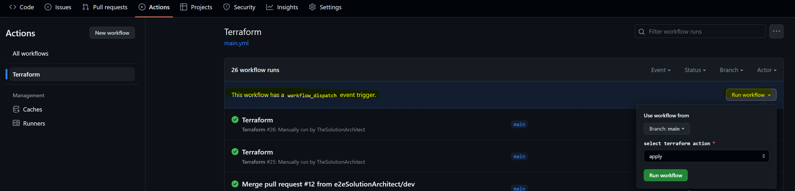

# GitAction integration with SonarCloud for Terraform code scan

Scan documentation. please [refer here](https://github.com/SonarSource/sonarcloud-github-action)

# Section: Code scan with SonarCloud

- ***Create GIT PAT (Personal Access Token )***
- - Click on top right user icon > Settings > Developers settings > Personal Access token > Tokens
  - Click on the button 'Generate new token'
  - Give a name and submit
  - Don't forget to copy the token it shows on the screen
 


 
- ***Create SONAR TOKEN (Personal Access Token )*** Open [sonar cloud](https://www.sonarsource.com/)
- - Click on top right user icon > My account > Security Tab
  - Enter a name for the token and generate
 


- ***Setup Git Secrets using the above two tokens***
- - Click on the repository > go to that particular repository 'Settings' > Secrets and Variables > Actions
  - Click the button 'New repository secret' and add GIT_TOKEN and SONAR_TOKEN 


- ***Update GitAction pipeline yml***
[pipeline yml](https://github.com/e2eSolutionArchitect/sonarcloud-gitaction-terraform-scan/blob/main/.github/workflows/pipeline.yml)
```
env:
      GITHUB_TOKEN: ${{ secrets.GIT_TOKEN }}
      SONAR_TOKEN: ${{ secrets.SONAR_TOKEN }}
```

## Want to point to your particular sonar URL?
```
# use below arg in the pipeline. 
-Dsonar.host.url = https://sonarcloud.io
```


# SonarCloud Scan


# Section: Setup GitAction Pipeline

## Development Steps:
- Create identity provider in IAM
- - IAM > Identity Providers > Add Provider > OpenID Connect
  - Provider: https://token.actions.githubusercontent.com
  - Click 'Get Thumbprint'
  - Add Provider
- Create IAM Role
- - Select 'Custom trust policy'
  - add trust policy json. [click here](https://github.com/e2eSolutionArchitect/aws-terraform-github-oidc/blob/main/docs/role-custom-trust-policy.json)
  - Role Name: aws-terraform-github-oidc
  - Policy
  - - [resource-access](https://github.com/e2eSolutionArchitect/aws-terraform-github-oidc/blob/main/docs/policy-github-oidc-terraform-aws-resource-access.json)
    - [tfstates-access](https://github.com/e2eSolutionArchitect/aws-terraform-github-oidc/blob/main/docs/policy-github-oidc-terraform-aws-tfstates-access.json)


## Kick Off Pipeline
- Pipeline will be automatically kicked-off on any push to main branch
- Go to 'Action' tab beside github potal's 'Pull Request' tab
- It should show a pipeline instance running after merging a pull request to main branch
```
  push:
    branches: [ "main" ]
```
- After successful Terraform Plan , the pipeline will wait for user's choice either apply or destroy. To choose the option, go back to the list view of pipelines (under Actions) and select the dropdoown "Run Workflow"


```
  workflow_dispatch:
    inputs:
      terraform_action:
        type: choice
        description: select terraform action
        options:
        - apply
        - destroy
        required: true
```
## Actions secrets and variables

Select repository > Settings (tab) > Secrets and Variables > Actions > Add 'New repository secret'

## Repository Secrets

|   |   |   |
|---|---|---|
|AWS_BUCKET_NAME | name of the bucket to store terraform state | my-s3-bucket |
|AWS_BUCKET_KEY_NAME |  path to the key file in the mentioned bucket | myproject/infra.tfstate|
|AWS_REGION |  the region where the resources will be deployed | us-east-1 |
|AWS_ROLE | the oidc role |arn:aws:iam::############:role/e2esa-aws-terraform-github-oidc |

